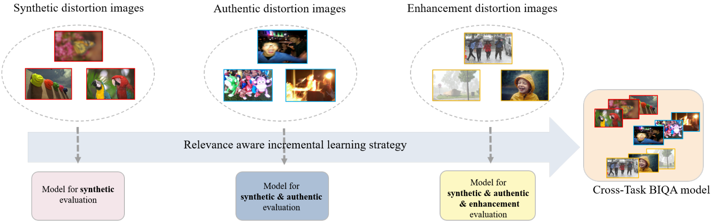
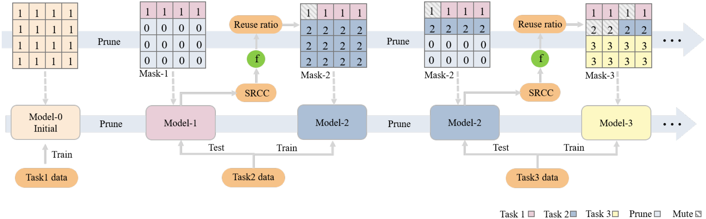
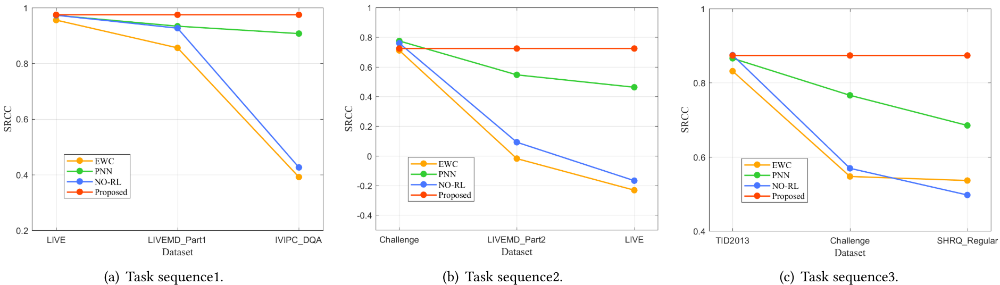

# Remember and Reuse: Cross-Task Blind Image Quality Assessment via Relevance-aware Incremental Learning
This repository contains PyTorch code of our paper: Remember and Reuse: Cross-Task Blind Image Quality Assessment via Relevance-aware Incremental Learning (ACM Multimedia 2021).
## Introduction
### 1. Cross-task blind image quality assessment process.

### 2. The flow diagram of Remember and Reuse network(R&R-Net) leaning a sequence of BIQA tasks.

### 3. Change in SRCC of the first task in the incremental learning process.

## Requirements
```python
Ubuntu 18.04
python == 3.6
torch == 1.2.0
torchvision == 0.4.0
tensorboard == 2.6.0
future == 0.18.2
scipy == 1.5.4
```
## Usage
### 1. Datasets and pre-trained Model
Download [crop_IQA_Datasets](https://drive.google.com/file/d/1D82ulUBoNAIO7u82FeDaKIJWjPVeksK2/view?usp=sharing), unzip it and put it in ./data;
Download ImageNet [pre-trained model](https://drive.google.com/file/d/1YyPM2OJ_H-aREnheTOkEtgj0_QQwkoaO/view?usp=sharing), put it in ./imagenet.
### 2. Training and testing
```python
python main.py
```
